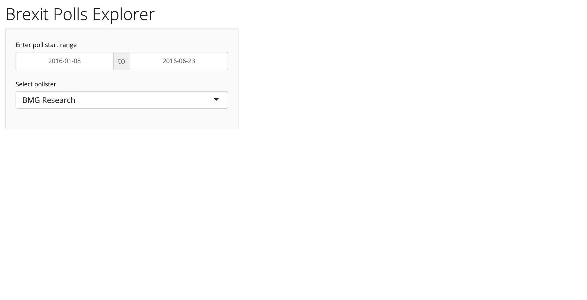

# STA 323 / 523 :: Lab 4

## Introduction

This lab will guide you through the process of building a web-based app
with R Shiny that explores polling data leading up to Brexit. The data
consists of poll outcomes for 127 polls from January 2016 to the referendum 
date on June 23, 2016.

Check out a complete version of the app [here](http://num1.stat.duke.edu:3939/brexit_polls/).
You'll first need to connect with Duke's VPN.

## Packages

If needed, install packages with `install.packages("pkg")`.

```r
library(shiny)
library(shinythemes)
library(tidyverse)
library(dslabs)
library(DT)
```

## Data

The data is made available through the `dslabs` package. Load the data with
`data("brexit_polls")`, and access the help with `?brexit_polls` to get more
information about the variables.

## App development

### User interface: Steps 1 - 5

#### Step 1

Get acquainted with the data - `brexit_polls`.

#### Step 2

Before the `ui` object, create a character vector of the unique pollsters
in `brexit_polls`. You will use this object in Step 3.

#### Step 3

In `sidebarPanel()` add a `dateRangeInput()` and `selectInput()`. The 
`dateRangeInput()` should allow a user to only select dates from "2016-01-08"
to "2016-06-23". The `selectInput()` should allow a user to select one of
the pollsters in `brexit_polls`.

#### Step 4

In `mainPanel()` add two `*Output()` functions - one for the plot,
the other for the data table.

#### Step 5

Add a title for your app inside `titlePanel("")`, and add 
`theme = shinytheme("yeti"),` immediately after `fluidPage(`. Feel free to
try one of the other themes available at https://rstudio.github.io/shinythemes/.
At the conclusion of Step 5 your app should look similar to the image below.



### Server function: Steps 6 - 9

#### Step 6

In a separate script file create a plot with `ggplot` that looks similar to
what you see in the completed app. Filter `brexit_polls` by `startdate` with
start and end dates, and filter by a given `pollster`.

#### Step 7

Modify your code from Step 6 by incorporating reactivity, and include it in an 
appropriate render function within function `server()`. Run your app and 
verify the plot updates when a user changes the dates or pollster.

#### Step 8

In a separate script file create a data frame that filters `brexit_polls` by 
`startdate` with start and end dates, filters the data by `pollster`, and
arranges the data frame by `startdate`.

#### Step 9

Modify you code from Step 8 by incorporating reactivity, and include it as
an expression in the render function `DT::renderDataTable()` within
function `server()`. At the conclusion of Step 9 your app should look and 
function similar to the app found [here](http://num1.stat.duke.edu:3939/brexit_polls/).

### Publication

#### Step 10

Create an account at https://www.shinyapps.io/. Publish your developed app.

## References

1. Shiny Themes. (2020). Retrieved 6 June 2020, 
   from https://rstudio.github.io/shinythemes/

2. DT: An R interface to the DataTables library. (2020). Retrieved 6 June 2020, 
   from https://rstudio.github.io/DT/

